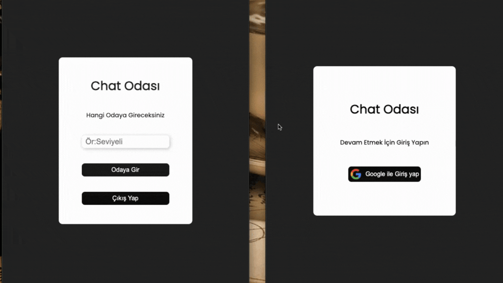

## Firebase Chat Uygulaması

- Bu proje, Firebase kullanarak oluşturulmuş basit bir chat uygulamasıdır. Kullanıcılar gerçek zamanlı olarak birbirleriyle mesajlaşabilirler.

# Özellikler

- Kullanıcı kaydı ve girişi
- Gerçek zamanlı mesajlaşma
- Mesajların Firebase Realtime Database'e kaydedilmesi
- Kullanıcıların aktif durumlarının gösterilmesi

# Kullanılan Teknolojiler

- Firebase Authentication: Kullanıcı kimlik doğrulama
- Firebase Realtime Database: Mesajların saklanması ve gerçek zamanlı senkronizasyon
- Firebase Cloud Firestore: Opsiyonel, kullanıcı bilgileri ve ek veriler için
  JavaScript/React: Frontend geliştirme için

# gif

 
# Firebase-Chat_App
